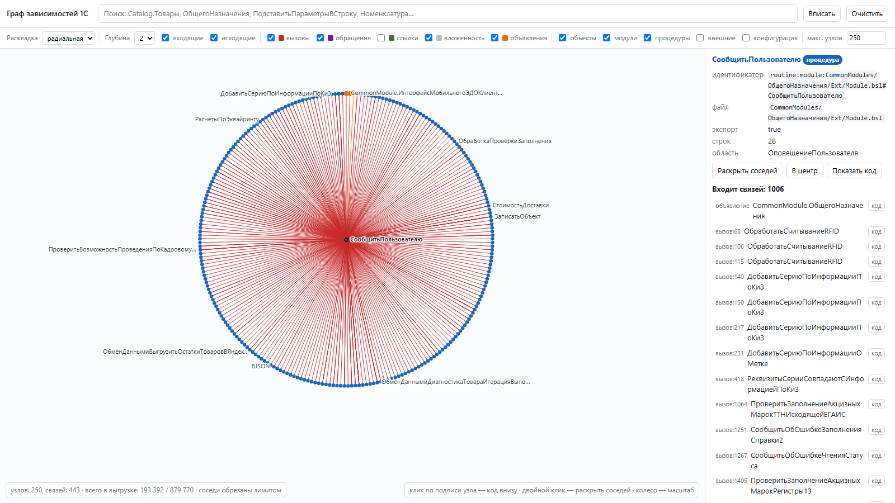
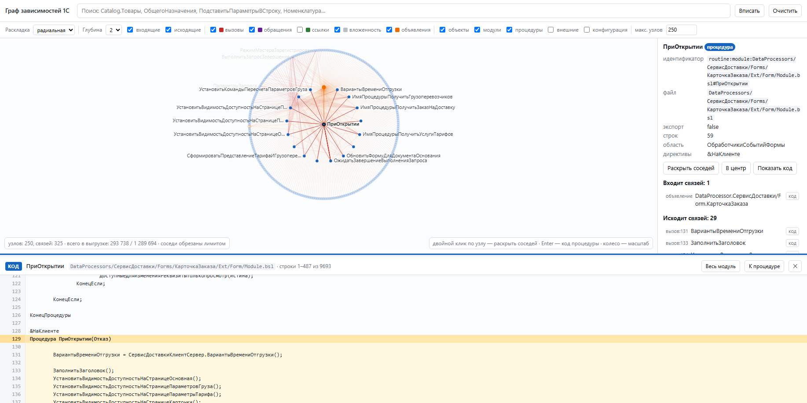

# Data1C

Исследовательский проект: разбор выгрузки конфигурации 1С (формат «Выгрузить конфигурацию в файлы» —
XML + BSL) и построение **графа зависимостей**: объекты метаданных, модули, процедуры и связи между ними.

Целевая платформа — .NET 10, C#.

## Состав решения

| Проект | Назначение |
|---|---|
| `src/Data1c.Core` | **Библиотека.** Абстракции ввода, модель метаданных, лексер и структурный разбор BSL, сборка графа, запросы к графу, экспорт в JSON и Graphviz DOT |
| `src/Data1c.Cli` | **Реализация библиотеки.** Консольное приложение `data1c`: источник выгрузки на файловой системе, команды `stats`, `scan`, `view`, встроенная страница просмотрщика (`Viewer/index.html`) |
| `tests/Data1c.Tests` | Тесты (xunit 2.9.3) |
| `tools/Data1c.TestRunner` | Раннер тестов: в этом окружении `dotnet test` не запускается (см. «Тесты») |
| `docs/` | Иллюстрации для документации |

Разделение ответственности: библиотека не знает, откуда берутся файлы — она работает через
`IDumpSource`. Файловую систему, каталог и командную строку реализует `Data1c.Cli`. Благодаря этому
библиотеку можно направить на zip-архив, базу данных или тестовый набор в памяти.

## Быстрый старт

```powershell
dotnet build Data1C.sln

# сводка по выгрузке
dotnet src\Data1c.Cli\bin\Debug\net10.0\data1c.dll stats C:\dump\1c_files

# граф в JSON
dotnet src\Data1c.Cli\bin\Debug\net10.0\data1c.dll scan C:\dump\1c_files --out graph.json

# граф в DOT только по общим модулям
dotnet src\Data1c.Cli\bin\Debug\net10.0\data1c.dll scan C:\dump\1c_files --format dot --sections CommonModules --out modules.dot

# интерактивный просмотрщик графа в браузере
dotnet src\Data1c.Cli\bin\Debug\net10.0\data1c.dll view C:\dump\1c_files --open

data1c help
```

Основные опции: `--sections a,b,c`, `--no-bsl`, `--no-routines`, `--no-calls`, `--no-metadata-refs`,
`--no-metadata-use`, `--no-external`, `--nested`, `--role-rights`, `--dot-max-nodes N`, `--max-dop N`, `--quiet`.

## Публичный API библиотеки

| Тип | Роль |
|---|---|
| `IDumpSource`, `DumpFile`, `InMemoryDumpSource` | источник файлов выгрузки; реализация для каталога — в `Data1c.Cli` |
| `MetadataDumpReader`, `MetadataReadOptions`, `MetadataReadResult` | чтение XML-метаданных: `MdObjectModel`, файлы модулей, предупреждения |
| `MdObject`, `MdKind`, `MdReference`, `MdNaming`, `MdRefParser` | модель метаданных и разбор строковых ссылок (`cfg:CatalogRef.Товары`) |
| `BslLexer`, `BslModuleParser` (`IBslModuleParser`), `BslModuleInfo` | лексика и структура BSL: процедуры, функции, области, директивы, вызовы, обращения к метаданным |
| `DependencyGraphBuilder`, `DependencyGraph`, `GraphNode`, `GraphEdge` | сборка и представление графа |
| `GraphQueryService` | запросы к графу: поиск узлов, окружение узла, карточка узла |
| `SourceCodeReader`, `CodeFragment` | чтение исходных текстов модулей и XML по требованию (для панели кода) |
| `GraphJsonWriter`, `GraphDotWriter` | экспорт графа |
| `DumpAnalyzer`, `AnalysisOptions`, `AnalysisResult` | сквозной сценарий: выгрузка → метаданные → BSL → граф |

Пример:

```csharp
var source = new FileSystemDumpSource(@"C:\dump\1c_files");   // реализация из Cli
var result = new DumpAnalyzer().Analyze(source);

Console.WriteLine(result.Graph.Statistics.NodeCount);

var routine = "routine:module:CommonModules/ОбщегоНазначения/Ext/Module.bsl#МояПроцедура";
foreach (var caller in result.Graph.Callers(routine))
{
    Console.WriteLine(caller);
}
```

## Просмотр графа

Полный граф (570 889 узлов, 2.6 млн связей) нарисовать нельзя ничем — поэтому просмотр построен на
принципе «фокус + раскрытие соседей»: на холсте всегда окружение выбранного узла, а не весь граф.

### Интерактивный просмотрщик

```powershell
data1c view C:\dump\1c_files --open
data1c view C:\dump\1c_files --sections CommonModules --no-routines --port 8081 --open
```

Команда разбирает выгрузку, держит граф в памяти и поднимает локальный HTTP-сервер только на
`127.0.0.1`. Порт по умолчанию выбирает система (в Windows порт 8080 нередко попадает в исключённые
диапазоны Hyper-V/WSL — тогда просмотрщик сам возьмёт свободный порт и напишет об этом); зафиксировать
порт можно ключом `--port N`. Страница просмотрщика — один самодостаточный HTML без внешних
библиотек и CDN: рисует на canvas, поэтому работает без интернета. Сервер отдаёт `/api/stats`,
`/api/search`, `/api/expand`, `/api/node`, `/api/code`; ссылку на конкретный узел можно передать
коллеге: `http://127.0.0.1:<порт>/?id=<идентификатор узла>`.

Что умеет страница:

- поиск по идентификатору, имени, **синониму** (`Номенклатура` найдёт `Catalog.Товары`) и пути файла;
- глубина обхода 1–4, направление связей (входящие/исходящие), фильтры по типам связей и узлов, лимит узлов;
- двойной клик по узлу — раскрыть соседей, клик — карточка справа (вид объекта, синоним, файл, uuid,
  экспорт, строки, область, директивы) и списки связей со строками вида `вызов:1234 …`;
- раскладка: **радиальная** (по умолчанию) или силовая, кнопка «Вписать», зум колесом, перетаскивание узлов;
- панель кода под холстом: исходный текст процедуры, модуля или XML объекта (см. «Код прямо в просмотрщике»).

Две раскладки — не украшательство. В 1С типичны «хабы»: у общего модуля сотни процедур, у
конфигурации десятки тысяч детей. Силовая укладка на таких данных схлопывается в нечитаемый клубок,
поэтому по умолчанию используется радиальная: центр — выбранный узел, каждый следующий шаг связей на
своём кольце, подписи расходятся наружу от центра. Узел «Конфигурация» по умолчанию выключен именно
потому, что при раскрытии он затапливает картину.



### Код прямо в просмотрщике

Панель с исходным текстом открывается **внутри страницы**, под холстом, — переключаться в редактор не
нужно. Открыть её можно:

- **кликом по подписи узла прямо на холсте** — подпись работает как ссылка: при наведении курсор
  становится указателем, текст синеет и подчёркивается, а клик открывает код в нижней панели;
- кликом по имени узла в карточке справа;
- кнопкой «Показать код» в карточке узла;
- клавишей `Enter` (или `К`) для выбранного узла;
- кнопкой `код` рядом с любой связью в списках «Входит/Исходит связей» — фокус графа при этом не
  смещается, поэтому можно идти по цепочке вызовов и читать код на каждом шаге;
- ссылкой `?id=<узел>&code=1` (а `code=full` — сразу весь файл).

Чтобы клик по тексту был однозначным, подписи размещаются **без наложений**: сначала места занимают
подпись выбранного и подсвеченного узла, затем самые связанные; остальные появляются при увеличении
масштаба. Поэтому любая видимая подпись кликается ровно в свой узел — это проверено самотестом
(клик в центр каждой подписи должен вернуть именно её узел).

По умолчанию показывается **весь модуль**, если он не больше 6000 строк: так видно окружение
процедуры — соседние функции, области, шапку модуля. Для больших модулей грузится окно ±300 строк
вокруг процедуры и появляется кнопка «Весь модуль». Процедура подсвечена, строка объявления
(`Процедура Имя(...)`) выделена отдельно, прокрутка сразу встаёт на неё; кнопка «К процедуре»
возвращает к ней, если уехали. Для узла-модуля показывается файл, для объекта метаданных — его XML.
Высота панели тянется за верхнюю границу, закрывается по `Esc` или `✕`.



Чтение исходников живёт в библиотеке — `SourceCodeReader` поверх той же абстракции `IDumpSource`.
Файлы читаются по требованию (в памяти держатся только последние 16 модулей), при этом доступно
лишь то, что реально есть в выгрузке, и только текстовые расширения: белый список строится по
составу выгрузки, поэтому запрос вроде `/api/code?path=../../etc/passwd` ничего не вернёт.

В статичной странице (`--static`) доступа к файлам нет: кнопок кода там не показывается, а панель
честно сообщает, что исходники открываются в режиме сервера — `data1c view <каталог>`.

### Статичная страница

```powershell
data1c view C:\dump\1c_files --focus "CommonModule.ОбщегоНазначения" --depth 2 --max-nodes 300 --static --out module.html --open
```

Тот же просмотрщик, но данные подграфа вшиты в файл: получается переносимая страница на сотни
килобайт, которую можно приложить к отчёту или отправить коллеге. В статичном режиме работают поиск
по загруженным узлам, карточка узла и фильтры (они применяются на клиенте). Внешние узлы-заглушки в
статичную страницу не попадают, чтобы не занимать лимит.

### Graphviz

Формат `--format dot` даёт файл для Graphviz (`dot -Tsvg modules.dot -o modules.svg`), но сам Graphviz
в систему не входит: `winget install Graphviz.Graphviz`. Вариант хорош для статичных картинок в
документации, интерактива в нём нет — для этого есть просмотрщик выше.

## Формат выгрузки 1С: что выяснено на реальной конфигурации

Выгрузка — это каталог с XML и BSL (не `.cf`/`.dt`). Формат `version="2.20"`, пространство имён
`http://v8.1c.ru/8.3/MDClasses`. Наблюдённые размеры: ~65 000 файлов, ~2.9 ГБ, из них ~628 МБ BSL и
~43 000 XML; файлы `*.bin` (макеты, драйверы оборудования) — основной объём и в разборе не участвуют.

Раскладка объектов:

```
Configuration.xml                       корень конфигурации + список детей по именам
ConfigDumpInfo.xml                      служебный (версии объектов)
Ext/*.bsl                               модули конфигурации (ManagedApplicationModule, SessionModule, ...)
<Секция>/<Имя>.xml                      объект метаданных
<Секция>/<Имя>/Ext/ObjectModule.bsl     модуль объекта
<Секция>/<Имя>/Ext/ManagerModule.bsl    модуль менеджера
<Секция>/<Имя>/Forms/<Форма>.xml        форма
<Секция>/<Имя>/Forms/<Форма>/Ext/Form/Module.bsl
<Секция>/<Имя>/Commands/<Команда>/Ext/CommandModule.bsl
<Секция>/<Имя>/Templates/<Макет>/Ext/Template.xml|.bin
Roles/<Имя>/Ext/Rights.xml              права роли
Subsystems/<Имя>.xml                    подсистема, состав — через <xr:Item xsi:type="xr:MDObjectRef">
```

Особенности, которые учитывает reader:

- **Вложенные объекты и ссылки по имени.** `ChildObjects` родителя содержит как полноценные объекты
  (`<Attribute>` с `<Properties>`), так и ссылки по имени (`<Form>ФормаЭлемента</Form>`). Reader
  разбирает и то и другое, а затем заменяет ссылку полноценным объектом из отдельного файла.
- **Привязка модулей по пути.** Каталог объекта — это каталог его XML-файла плюс имя файла без
  расширения (`Catalogs/Товары`, `Catalogs/Товары/Forms/ФормаЭлемента`). Модуль привязывается подъёмом
  по каталогам пути до первого совпадения, поэтому одинаково работают `Ext/ObjectModule.bsl`,
  `Forms/<Форма>/Ext/Form/Module.bsl` и модули команд, у которых нет собственного XML-файла.
- **Не разбираются** (пропускаются по имени файла, содержимое не читается): `Rights.xml` (по умолчанию),
  `Form.xml` (logform управляемой формы), `Template.xml`, `Picture.xml`, `Help.xml`, `Package.xml`,
  `CommandInterface.xml`, `ClientApplicationInterface.xml`, `MainSectionCommandInterface.xml`,
  `HomePageWorkArea.xml`, `Logo.xml`, `Splash.xml`, `MainSectionPicture.xml`, `Schedule.xml`,
  `Flowchart.xml`, `DCS.xml`. Разбираются только файлы с корнем `MetaDataObject`.
- **Незавершённая выгрузка.** 1С пишет файлы последовательно и часть из них удерживает открытыми.
  Reader открывает файлы с `FileShare.ReadWrite | FileShare.Delete`, а занятые и частично записанные
  файлы пропускает с предупреждением — разбор не падает. Если `Configuration.xml` недоступен, корень
  конфигурации создаётся синтетически, а объекты из `ChildObjects` остаются в модели как ссылки по имени.

## Модель графа

Узлы (`GraphNodeKind`): `Configuration`, `MetadataObject`, `Module`, `Routine`, `External`.
Связи (`GraphEdgeKind`): `Contains` (вложенность), `References` (ссылки метаданных), `Defines`
(объявление процедуры), `Calls` (вызов), `UsesMetadata` (обращение к метаданным из кода).

Идентификаторы узлов:

| Узел | Пример |
|---|---|
| Конфигурация | `Configuration` |
| Объект метаданных | `Catalog.Товары` |
| Вложенный объект | `Catalog.Товары/Form.ФормаЭлемента` |
| Модуль | `module:CommonModules/ОбщегоНазначения/Ext/Module.bsl` |
| Процедура / функция | `routine:module:CommonModules/.../Module.bsl#МояПроцедура` |
| Цель вне выгрузки | `call:ОбщегоНазначения.ЗначениеРеквизитаОбъекта`, `Catalog.ЕдиницыИзмерения` |

Разрешение вызовов: локальный вызов (`МояПроцедура()`) ищется в том же модуле; вызов
`ОбщийМодуль.Метод()` разрешается в процедуру соответствующего общего модуля; всё остальное
(вызовы через переменные, методы менеджеров, платформенные функции) фиксируется внешним узлом
`call:<текст вызова>`, поэтому ни одна зависимость не теряется.

Осознанные ограничения: реквизиты и табличные части по умолчанию не становятся узлами графа
(их ссылки приписываются ближайшему родителю, чтобы типы не пропадали) — включается опцией
`IncludeNestedObjects` / `--nested`; вызовы платформенных методов не отделяются от пользовательских.

## Проверка на реальной конфигурации

Замеры на выгрузке «1С:Управление нашей фирмой» (~65 000 файлов, 2.9 ГБ, из них 628 МБ BSL,
43 000 XML), 32-ядерная машина, `Release`:

| Показатель | Значение |
|---|---|
| Разбор метаданных | 27 257 XML-файлов, 0 ошибок, ~11 с |
| Разбор BSL | 14 737 модулей (628 МБ), 0 предупреждений |
| Объекты метаданных | 84 166, из них 16 256 верхнего уровня |
| Процедуры и функции | 191 608 процедур + 67 224 функции |
| Граф | 570 889 узлов, 2 603 941 связь |
| Полный проход (`stats`) | ~20 с, пик рабочего набора 2.8 ГБ |
| Экспорт полного графа в JSON | ~25 с, 1.1 ГБ |

Распределение связей: `Calls` 2 131 935, `Defines` 258 832, `UsesMetadata` 83 508, `References` 69 317,
`Contains` 60 349. Внешних узлов 251 707 — это вызовы через переменные и методы менеджеров
(`call:Объект.Метод`), которые по тексту модуля разрешить нельзя.

Полный граф в JSON занимает больше гигабайта, поэтому для просмотра и обмена удобнее ограничивать
разбор: `--sections`, `--no-routines`, `--no-calls` или формат DOT с `--dot-max-nodes`.

## Тесты

```powershell
dotnet run --project tools\Data1c.TestRunner\Data1c.TestRunner.csproj                                  # все тесты
dotnet run --project tools\Data1c.TestRunner\Data1c.TestRunner.csproj -- --filter=Data1c.Tests.Metadata # подмножество
```

Стандартный `dotnet test` в этом окружении неприменим: testhost падает с `Win32Exception (5)` при
попытке открыть handle родительского процесса. `tools/Data1c.TestRunner` — минимальный раннер,
который находит `[Fact]`/`[Theory]` по отражению и выполняет их (код возврата 1 при падениях).

## Направления развития

- Хранилище графа (SQLite) и запросы вида «кто использует реквизит X», «кто вызывает Y».
- Экспорт GraphML/GEXF для Gephi и Neo4j — когда встроенного просмотрщика перестанет хватать.
- Компактный формат выгрузки графа (CSV/Parquet) вместо JSON на гигабайт.
- Разрешение вызовов вида `Объект.Метод` через вывод типов переменных — сейчас они попадают во внешние узлы.
- Диф двух выгрузок: какие связи появились и исчезли.
- Разбор управляемых форм (`Ext/Form.xml`): обработчики событий, привязки к реквизитам.
- Инкрементальный разбор с кешем по `ConfigDumpInfo.xml` (версии объектов).
- Разбор прав ролей в графе по умолчанию (`--role-rights` даёт сотни тысяч рёбер).
